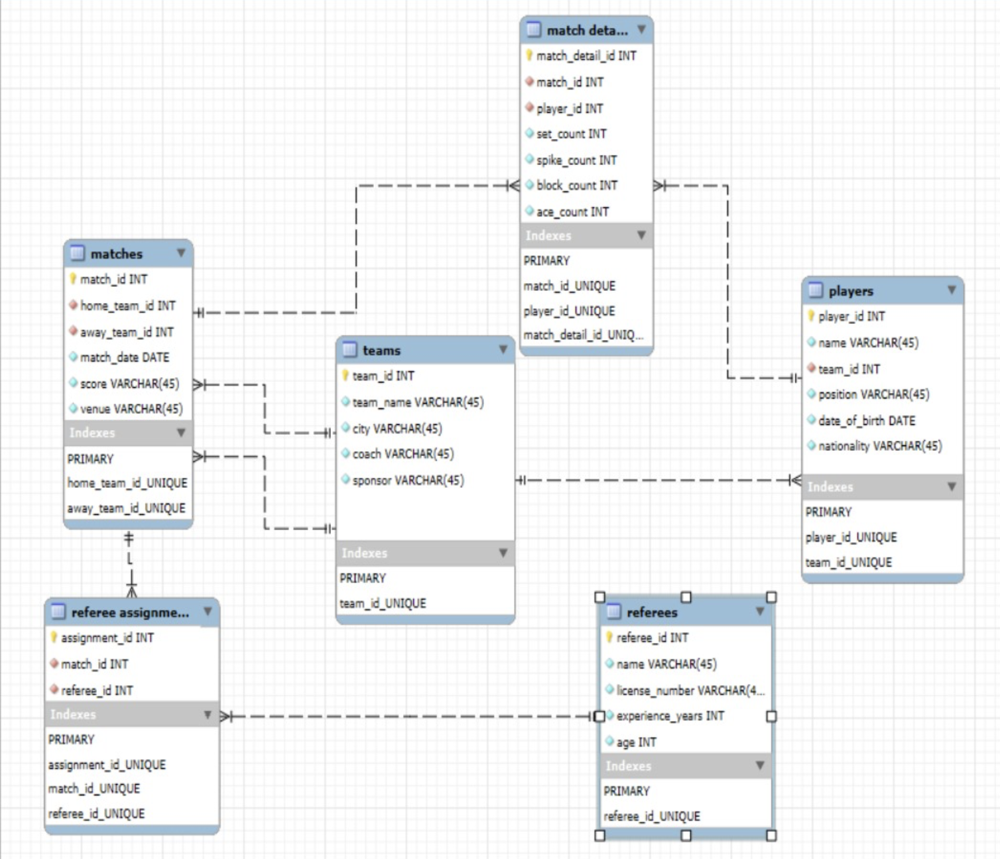

# Volleyball League SQL Analysis

## Project Overview
This project is an end-to-end SQL analysis of a volleyball league dataset using a relational database structure.  
The goal is to analyze player and team performance through structured queries and extract meaningful insights from the data.

---

## Project Motivation
This project was originally developed as an academic database design assignment.  
It has been extended and improved into a data analysis project by enhancing the schema and adding analytical SQL queries.

---

## Database Schema

The following diagram illustrates the relational structure of the database:

---

## Dataset Description

The database consists of the following tables:

- **teams** → team information (name, city, coach, sponsor)  
- **players** → player details (position, nationality, team)  
- **matches** → match results and metadata  
- **match_details** → player performance metrics (spikes, blocks, aces)  
- **referees** → referee information  
- **referee_assignments** → referee-match relationships  

---

## Key Analyses

### Player Performance
- Peak performance (maximum spikes in a match)
- Total performance (overall spike contribution)

### Team Performance
- Total spikes by team (offensive strength)

### Match Analysis
- Matches with the highest number of sets

### Referee Analysis
- Number of matches officiated by each referee

---

## Key Insights

- Individual peak performance and team performance differ significantly  
- Certain players stand out with exceptional single-match performance  
- Team-level success is driven by cumulative contributions  

---

## Tools Used

- PostgreSQL  
- DBeaver  

---

## How to Use

1. Run `schema.sql` to create the database  
2. Run `sample_data.sql` to insert data  
3. Use `analysis_queries.sql` to perform analysis  

---

## Notes

The dataset used in this project is synthetic and created for demonstration purposes.
